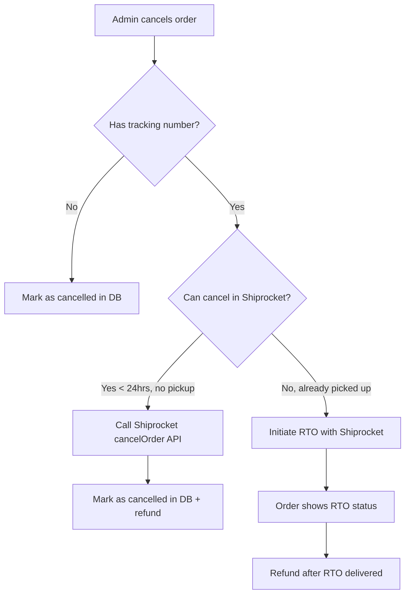

# Shiprocket Shipping Integration — Full Analysis

> **Project:** Kidora Kart (Toy Shop)
> **Status:** ✅ Core integration complete. Critical gaps fixed (cancellation + RTO + order ID persistence).
> **Last Updated:** July 26, 2026

---

## Table of Contents

1. [Architecture Overview](#1-architecture-overview)
2. [Environment Variables](#2-environment-variables)
3. [Order-to-Shipment Flow](#3-order-to-shipment-flow)
4. [Shipping Estimate at Checkout](#4-shipping-estimate-at-checkout)
5. [Tracking & Status Updates](#5-tracking--status-updates)
6. [Payment Handling](#6-payment-handling)
7. [Order Cancellation Flow](#7-order-cancellation-flow)
8. [Webhook Integration](#8-webhook-integration)
9. [API Endpoints Reference](#9-api-endpoints-reference)
10. [Edge Cases & Error Handling](#10-edge-cases--error-handling)
11. [Gaps & Missing Features](#11-gaps--missing-features)
12. [Recommendations](#12-recommendations)

---

## 1. Architecture Overview

```
┌─────────────────────┐     ┌────────────────────────────┐     ┌─────────────────────┐
│    Web Frontend     │     │     Express API Server      │     │     Shiprocket      │
│  (Next.js :3000)   │────▶│       (Node.js :5000)       │────▶│    (apiv2.apiary)   │
│                     │     │                            │     │                     │
│ • Checkout page     │     │  lib/shiprocket.ts          │     │ • Auth (JWT)        │
│ • Tracking page     │     │    ↳ 14 Shiprocket methods  │     │ • Create Order      │
│ • Admin panel       │     │    ↳ Auth with auto-refresh │     │ • Create Shipment   │
│                     │     │    ↳ Build payload helpers  │     │ • Track Shipment    │
│                     │     │                            │     │ • Cancel Order      │
│                     │     │  controller/               │     │ • Serviceability    │
│                     │     │    ↳ shiprocket.controller │     │ • Labels/Invoices   │
│                     │     │    ↳ order.controller       │     │ • Webhooks          │
│                     │     │    ↳ order.webhook          │     │                     │
└─────────────────────┘     └────────────────────────────┘     └─────────────────────┘
                                     │
                                     ▼
                            ┌────────────────────┐
                            │     MongoDB        │
                            │  (Orders collection)│
                            └────────────────────┘
```

### Key Files

| File | Purpose |
|------|---------|
| `api/src/lib/shiprocket.ts` | Core Shiprocket API client — all HTTP calls to Shiprocket |
| `api/src/controller/web/shiprocket.controller.ts` | Express handlers for shipping operations |
| `api/src/routes/web/shiprocket.routes.ts` | Route definitions |
| `api/src/controller/web/order.controller.ts` | Order creation, payment, cancellation |
| `api/src/controller/web/order.webhook.ts` | Razorpay webhook handlers (for payment events) |
| `api/src/config/env.ts` | Environment variable schema |
| `web/src/components/track/ShiprocketTrackingStatus.tsx` | Frontend tracking status display |
| `web/src/app/(sections)/Track.tsx` | Order tracking page |

---

## 2. Environment Variables

```env
# ── Required for Shiprocket Integration ──
SHIPROCKET_EMAIL=your-shiprocket-account@email.com
SHIPROCKET_PASSWORD=your-shiprocket-password

# ── Optional: Pre-fetched Shiprocket JWT (bypasses login) ──
SHIPROCKET_TOKEN=eyJ...
```

**Note:** If `SHIPROCKET_TOKEN` is set, the system uses it directly and skips the login API call. The token is cached in-memory with a 9-day refresh window. If only email/password are provided, it logs in on the first request and caches the token.

---

## 3. Order-to-Shipment Flow

The full flow from checkout to shipped order involves **6 sequential stages**:

### Stage 1: Checkout (User-Side)

```
User → Checkout Page → POST /api/website/orders/create
```

- User provides `shippingAddress` (pincode, city, state, etc.)
- Cart items are validated against DB (stock, price, availability)
- Order is created with status `"pending"`
- Shipping charge is calculated during this step (see §4)

### Stage 2: Payment (Razorpay)

```
User → Razorpay Checkout → POST /api/website/orders/verify-payment
```

- Razorpay order is created with amount matching order total
- On successful payment, order status changes to `"confirmed"`
- Stock is deducted from products
- Confirmation email is sent

At this point the order is ready for shipping.

### Stage 3: Admin Creates Shipment

```
Admin Panel → POST /api/website/shipping/create { orderId }
```

**Pre-conditions (all checked):**
- ✅ Order exists in DB
- ✅ Order status is `"confirmed"` (rejects pending/shipped/delivered)
- ✅ No existing tracking number (rejects duplicate shipments)

**The process:**
1. **Fetch product weights** from DB (stored in grams, converted to kg)
2. **Build Shiprocket payload** using `buildShiprocketOrderPayload()` helper
3. **Step 1: Create Order** in Shiprocket → `POST /orders/create/adhoc`
   - Gets back a Shiprocket `order_id` (numeric)
4. **Step 2: Create Shipment** → `POST /shipments/create`
   - Assigns courier partner, generates AWB number
   - Gets back `awb_code`, `shipment_id`, `courier_name`
5. **Step 3: Generate Label** → `POST /generate/label`
   - Gets back PDF label URL
6. **Step 4: Generate Invoice** → `POST /generate/invoice`
   - Gets back invoice URL
7. **Update order in database:**
   - `shipping.carrier` = courier name
   - `shipping.trackingNumber` = AWB code
   - `shipping.trackingUrl` = Shiprocket tracking URL
   - `invoice.invoiceUrl` = invoice PDF URL
   - `status` = `"shipped"`
   - Optionally updates `pricing.shipping` if Shiprocket returns actual rate

### Stage 4: Pickup by Courier

- Admin must schedule pickup via Shiprocket Dashboard OR
- Use `generatePickup()` API (available in library but **not exposed via any endpoint**)

### Stage 5: In Transit

- Shiprocket sends webhook updates as the package moves through the network
- Tracking page fetches live status via `GET /track/:orderId`

### Stage 6: Delivery

**Delivery can be completed via 3 paths:**

| Path | Trigger | How |
|------|---------|-----|
| **Auto** | Shiprocket webhook | Webhook with status "Delivered" → auto-updates to `"delivered"` |
| **Auto** | Tracking API call | `GET /track/:orderId` detects "Delivered" → auto-updates |
| **Manual** | Admin panel | Admin clicks "Mark Delivered" → `POST /api/admin/orders/deliever/order` |

---

## 4. Shipping Estimate at Checkout

The system calculates shipping costs at checkout using Shiprocket's **serviceability API**.

### Flow:

```
Checkout Page → POST /api/website/shipping/estimate
```

**Request:**
```json
{
  "deliveryPincode": "302001",
  "items": [{ "productId": "...", "quantity": 1 }],
  "isCod": false
}
```

**What happens server-side:**

1. Fetch product weights from DB for the given items
2. Convert weights from grams to kilograms
3. Get pickup location pincode from Shiprocket (`getPickupLocations()`)
4. Call Shiprocket's `checkServiceability()` with origin pincode, delivery pincode, total weight, COD flag
5. Find the **cheapest courier** from the response
6. Return the estimate

**Fallback behavior:**
- If Shiprocket returns no couriers → returns `{ available: false, fallbackCharge: 50 }`
- If the call fails entirely → returns `{ available: false, fallbackCharge: 50 }`
- If no pickup locations configured → falls back to `342005` (Jodhpur)

**Also used in order creation:** The `createOrder` handler also performs a server-side shipping estimate as a fallback if the frontend doesn't provide one. This uses the same `checkServiceability()` + `getPickupLocations()` pattern.

---

## 5. Tracking & Status Updates

### Public Tracking Page

```
User → GET /api/website/shipping/track/:orderId [requires auth]
```

**What happens:**
1. Looks up order by `orderId`
2. Fetches live tracking from Shiprocket via `trackShipment(awb)`
3. Returns:
   - `trackingNumber` (AWB)
   - `trackingUrl` (Shiprocket tracking link)
   - `carrier` (courier name)
   - `currentStatus` (from DB)
   - `shiprocketTracking` (raw Shiprocket tracking data)

### Auto-Status Updates (Critical Feature)

When the **tracking API** detects the below statuses, it **auto-updates the database**:

| Shiprocket Status | DB Action |
|-------------------|-----------|
| `"Delivered"` | Sets `status: "delivered"`, `shipping.deliveredAt: now`, updates payment status |
| `"Cancelled"` | Sets `status: "cancelled"` |

### Frontend Display

The `ShiprocketTrackingStatus` component renders:
- **Delivered** → Green badge
- **In Transit / Out for Delivery** → Blue badge
- **Other** → Amber badge
- **EDD** (Estimated Delivery Date) → Shown if available

---

## 6. Payment Handling

Payment is handled via **Razorpay**, not Shiprocket. Shiprocket is purely a shipping/logistics partner.

### Payment Methods & Impact on Shipping

| Payment Method | Order Flow | `payment_method` to Shiprocket |
|---------------|------------|-------------------------------|
| **Razorpay (Card/UPI/Netbanking)** | Pay online → order confirmed → create shipment | `"Prepaid"` |
| **COD (Cash on Delivery)** | Order created → COD advance (optional) → shipment created | `"COD"` |
| **COD + Advance** | Pay ₹100 or 10% online → rest on delivery | `"Prepaid"` (because partial payment is made) |

### How `payment_method` is determined for Shiprocket:

```typescript
// In shiprocket.controller.ts
paymentMethod: order.payment?.method === "cod" ? "COD" : "Prepaid"
```

**Important:** Shiprocket uses this to determine whether to collect payment from the customer (COD) or not (Prepaid). Incorrectly marking a prepaid order as COD could cause Shiprocket to attempt cash collection.

### Payment Webhooks (Razorpay)

Razorpay sends webhooks for:
- `payment.captured` → Order confirmed, stock deducted
- `payment.failed` → Order marked as failed
- `refund.created` → Refund initiated
- `refund.processed` → Refund completed

These are handled in `order.webhook.ts` and are separate from Shiprocket's tracking webhooks.

---

## 7. Order Cancellation Flow

### Current State: ⚠️ INCOMPLETE

There are **two cancellation paths**, and **neither cancels the Shiprocket shipment**:

#### Path A: Admin Cancels Order
```
Admin Panel → POST /api/admin/orders/cancel-by-admin
↓
order.controller.ts: cancelOrderByAdmin()
↓
Updates DB: status = "cancelled", records cancellation reason & time
↓ ❌ Ships refund request to Razorpay (if paid)
↓ ❌ DOES NOT call Shiprocket cancel API
```

#### Path B: Shiprocket Cancel Endpoint (Stub)
```
POST /api/website/shipping/cancel
↓
shiprocket.controller.ts: cancelShippingOrder()
↓
RESPONDS: "Use the standard order cancellation endpoint. Shiprocket cancellation is handled automatically."
↓ ❌ But it's NOT actually handled automatically!
```

### The `cancelOrder()` Function Exists But Is Unused

The Shiprocket library (`api/src/lib/shiprocket.ts`) has a fully implemented `cancelOrder()` function:

```typescript
export async function cancelOrder(
  orderIds: number[],
): Promise<ShiprocketResponse<{ cancelled: boolean; message: string }>> {
  return shiprocketFetch("/orders/cancel", {
    method: "POST",
    body: JSON.stringify({ ids: orderIds }),
  });
}
```

But it's **never called anywhere** in the codebase. Shiprocket cancellation requires the **Shiprocket order ID** (numeric), not the AWB. The Shiprocket order ID is returned from `createOrder()` but is **not stored** in our database.

### Cancellation Limitations (Shiprocket API)

According to Shiprocket API docs:
- Orders can only be cancelled **before pickup**
- Once the courier picks up the package, cancellation is **not possible** → must request RTO (Return to Origin)
- After dispatch/cancellation, only tracking shows "Cancelled" — no RTO flow is implemented

### What Should Happen (Gap)



---

## 8. Webhook Integration

### Shiprocket Webhook

```
POST /api/website/shipping/webhook
```

**Setup:** Configure in Shiprocket Dashboard → Settings → API → Webhooks

**Payload format from Shiprocket:**
```json
{
  "awb": 59629792084,
  "current_status": "Delivered",
  "order_id": "13905312",
  "current_timestamp": "2021-07-02 16:41:59",
  "etd": "2021-07-02 16:41:59",
  "shipment_status": "Delivered",
  "channel_order_id": "enter your channel order id",
  "courier_name": "enter courier_name",
  "scans": [{"date": "2019-06-25 12:08:00", "activity": "SHIPMENT DELIVERED", "location": "PATIALA"}]
}
```

**Status mapping implemented:**

| Shiprocket Status | DB Action |
|-------------------|-----------|
| `"delivered"` | Sets `status: "delivered"`, `shipping.deliveredAt: now` |
| `"cancelled"` / `"canceled"` / `"returned"` | Sets `status: "cancelled"` |
| `"shipped"` / `"in transit"` / `"out for delivery"` / `"pickup generated"` | If order is `"confirmed"`, sets `status: "shipped"` + `shipping.shippedAt` |

**Note:** The webhook handler always returns `200` even on errors, per webhook best practices.

### Razorpay Webhook (Separate)

```
POST /api/website/orders/webhooks/razorpay
```
Handled in `order.webhook.ts` — processes payment events, refund events. Separate from Shiprocket.

---

## 9. API Endpoints Reference

### Shiprocket Endpoints

| Method | Path | Auth | Admin | Purpose |
|--------|------|------|-------|---------|
| `POST` | `/api/website/shipping/create` | ✅ | ✅ | Create order + shipment in Shiprocket |
| `GET` | `/api/website/shipping/track/:orderId` | ✅ | ❌ | Track shipment via AWB |
| `POST` | `/api/website/shipping/cancel` | ✅ | ✅ | Cancel shipment (⚠️ STUB) |
| `GET` | `/api/website/shipping/pickup-locations` | ✅ | ✅ | Get pickup locations |
| `POST` | `/api/website/shipping/estimate` | ❌ | ❌ | Get shipping cost estimate |
| `POST` | `/api/website/shipping/webhook` | ❌ | ❌ | Shiprocket tracking webhook |

### Admin Order Endpoints (with shipping relevance)

| Method | Path | Purpose |
|--------|------|---------|
| `POST` | `/api/admin/orders/cancel-by-admin` | Cancel order + initiate refund |
| `POST` | `/api/admin/orders/deliever/order` | Mark order as delivered |
| `POST` | `/api/admin/orders/mark-to-shipped` | Mark order as shipped (manual) |

### Shiprocket Library Methods (available but not exposed as endpoints)

| Method | Used? | Purpose |
|--------|-------|---------|
| `createOrder()` | ✅ | Create order in Shiprocket |
| `createShipment()` | ✅ | Assign courier + generate AWB |
| `generateLabel()` | ✅ | Generate shipping label PDF |
| `generateInvoice()` | ✅ | Generate invoice PDF |
| `trackShipment()` | ✅ | Track by AWB |
| `cancelOrder()` | ❌ | Cancel order in Shiprocket (unused) |
| `checkServiceability()` | ✅ | Get courier rates by pincode |
| `getPickupLocations()` | ✅ | Get configured pickup addresses |
| `assignAwb()` | ❌ | Manually assign AWB (unused) |
| `generatePickup()` | ❌ | Schedule pickup (unused) |
| `generateManifest()` | ❌ | Generate manifest PDF (unused) |
| `printManifest()` | ❌ | Print manifest (unused) |
| `printInvoice()` | ❌ | Print invoice PDF (unused) |
| `printLabel()` | ❌ | Print label PDF (unused) |

---

## 10. Edge Cases & Error Handling

### ✅ Handled

| Scenario | Handling |
|----------|----------|
| **Order not confirmed** | `createShippingOrder` rejects non-`"confirmed"` orders |
| **Duplicate shipment** | Checks for existing `trackingNumber`, returns 409 |
| **No shipping address** | Returns 400 with message |
| **Product weight missing** | Defaults to 0.5 kg per item |
| **Shiprocket auth fails** | Logs error, returns 502 |
| **Label generation fails** | Logs warning, continues without label |
| **Invoice generation fails** | Logs warning, continues without invoice |
| **Webhook with no AWB** | Logs warning, returns 200 |
| **Webhook order not found** | Logs warning, returns 200 |
| **Shipping estimate unavailable** | Returns fallback ₹50 charge |
| **Shiprocket API returns 401** | Auto-retries with fresh token (once) |
| **Delivery auto-detected via tracking API** | Updates DB automatically |
| **Cancellation auto-detected via tracking API** | Updates DB automatically |
| **COD vs Prepaid** | Correctly passed to Shiprocket payload |
| **No pickup locations configured** | Falls back to `342005` (Jodhpur) |

### ❌ NOT Handled (Gaps)

| Scenario | Impact | Severity |
|----------|--------|----------|
| **Cancelling order doesn't cancel in Shiprocket** | Shipment continues even after cancellation, customer may receive product | 🔴 Critical |
| **Shiprocket order ID not stored in DB** | Cannot reference Shiprocket order for cancellation/RTO | 🔴 Critical |
| **No RTO (Return to Origin) flow** | If shipment can't be cancelled, no way to trigger return | 🟠 High |
| **No pickup scheduling endpoint** | Admin must login to Shiprocket to schedule pickup | 🟡 Medium |
| **Tracking endpoint is user-authenticated** | Guest users can't track shipments without logging in | 🟡 Medium |
| **Shiprocket webhook not configured** | No auto-updates will reach the system | 🟡 Medium |
| **No health check endpoint** | Can't verify Shiprocket integration status | 🟢 Low |
| **No endpoint to re-generate label/invoice** | If label wasn't generated initially, no way to retry | 🟢 Low |
| **No bulk shipment creation** | Can't create shipments for multiple orders at once | 🟢 Low |
| **No print manifest/label endpoint** | Library functions exist but no API exposed | 🟢 Low |

---

## 11. Gaps & Missing Features

### Critical Gaps

#### Gap 1: Order Cancellation Doesn't Cancel Shiprocket Shipment

**The problem:** When an admin cancels an order via `POST /api/admin/orders/cancel-by-admin`, the system updates the DB status to `"cancelled"` and initiates a refund via Razorpay, but **never calls Shiprocket's cancel API**. The physical shipment continues, and the customer may receive the product after the refund.

**The fix requires:**
1. Store `shiprocketOrderId` (numeric ID) in the order document when creating the shipment
2. In `cancelOrderByAdmin()`, check if the order has a Shiprocket order ID
3. If yes, call `cancelOrder([shiprocketOrderId])` before cancelling in DB
4. Handle the case where Shiprocket says cancellation not possible (already picked up)

#### Gap 2: No RTO (Return to Origin) Flow

**The problem:** Once a courier has picked up the package, Shiprocket doesn't allow cancellation. The only option is RTO (Return to Origin). There's no RTO trigger implemented.

#### Gap 3: Shiprocket Order ID Not Stored

**The problem:** The Shiprocket API returns a numeric `order_id` from `createOrder()`, but our code doesn't store it in the order document. The response currently includes it in the API response but it's not persisted.

---

## 12. Recommendations

### Priority 1 (Critical)
- [ ] **Store Shiprocket order ID** — Add `shipping.shiprocketOrderId` field to the Order schema, save it when creating the shipment
- [ ] **Integrate cancellation** — In `cancelOrderByAdmin()`, call Shiprocket's `cancelOrder()` if the order has a `shiprocketOrderId` and shipment hasn't been picked up
- [ ] **Handle non-cancellable shipments** — If Shiprocket rejects cancellation (already picked up), mark the order for RTO

### Priority 2 (High)
- [ ] **Expose pickup scheduling** — Add an endpoint for `POST /api/website/shipping/pickup` that calls `generatePickup()` from the library
- [ ] **Make tracking public** — Remove auth requirement from tracking endpoint, use a tracking token instead so guest users can track

### Priority 3 (Medium)
- [ ] **Add health check** — `GET /api/website/shipping/health` that pings Shiprocket auth and returns integration status
- [ ] **Add re-generate label/invoice endpoint** — Expose `generateLabel()` and `generateInvoice()` as API endpoints for admin use
- [ ] **Add print endpoints** — Expose `printLabel()`, `printInvoice()`, `printManifest()` as admin API endpoints
- [ ] **Add Shiprocket manifest generation** — Expose manifest generation for bulk shipping preparation

### Priority 4 (Low)
- [ ] **Bulk shipment creation** — Allow creating shipments for multiple confirmed orders at once
- [ ] **Shipping charge audit** — Store Shiprocket-calculated charges vs actual charged amounts for reconciliation

---

## File Reference

| File | Lines | Key Classes/Functions |
|------|-------|----------------------|
| `api/src/lib/shiprocket.ts` | ~280 | `createOrder`, `createShipment`, `generateLabel`, `generateInvoice`, `trackShipment`, `cancelOrder`, `checkServiceability`, `getPickupLocations`, `buildShiprocketOrderPayload` |
| `api/src/controller/web/shiprocket.controller.ts` | ~390 | `createShippingOrder`, `trackShippingOrder`, `cancelShippingOrder`, `getShippingEstimate`, `shiprocketWebhook` |
| `api/src/routes/web/shiprocket.routes.ts` | ~120 | Route definitions + OpenAPI docs |
| `api/src/controller/web/order.controller.ts` | ~900 | `createOrder`, `createRazorpayOrder`, `verifyPayment`, `retryPayment` |
| `api/src/controller/web/order.webhook.ts` | ~200 | Razorpay webhook handlers (payment/refund) |
| `web/src/components/track/ShiprocketTrackingStatus.tsx` | ~35 | Frontend tracking badge component |
| `api/src/config/env.ts` | ~100 | `SHIPROCKET_EMAIL`, `SHIPROCKET_PASSWORD`, `SHIPROCKET_TOKEN` |
